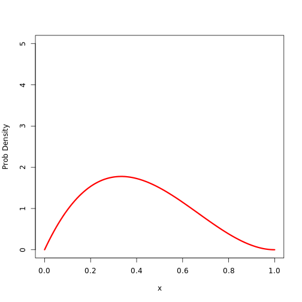
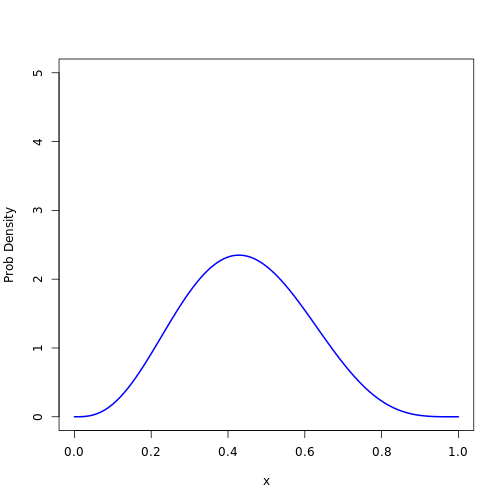

Day-19
========================================================
 

```r
x <- seq(0, 1, length = 101)
plot(1:2, ylim = c(0, 5), xlim = c(0, 1), xlab = "x", ylab = "Prob Density", 
    type = "n")
lines(x, dbeta(x, 1, 2), lwd = 1)
lines(x, dbeta(x, 1, 4), lwd = 2)
lines(x, dbeta(x, 4, 2), lwd = 3)
```

 


```r
drawBeta <- function(a, b, ...) {
    x <- seq(0, 1, length = 101)
    plot(1:2, ylim = c(0, 5), xlim = c(0, 1), xlab = "x", ylab = "Prob Density", 
        type = "n")
    lines(x, dbeta(x, a, b), ...)
}
```


```r
# drawBeta test
drawBeta(2, 3, lwd = 3, col = "red")
```

 

```r
drawBeta(4, 5, lwd = 2, col = "blue")
```

 


```r
# Now let's make it an interactive function
require(manipulate)
betaApp <- function(pts) {
    manipulate({
        drawBeta(a, b, col = color, lwd = c)
        points(pts, rep(0, length(pts)))
    }, a = slider(0, 10, initial = 1, label = "a", step = 0.2), b = slider(0, 
        10, initial = 2, label = "Bee", step = 0.2), c = slider(0, 50, initial = 5, 
        label = "Thickness", step = 1), color = picker(as.list(colors())))
}
```

